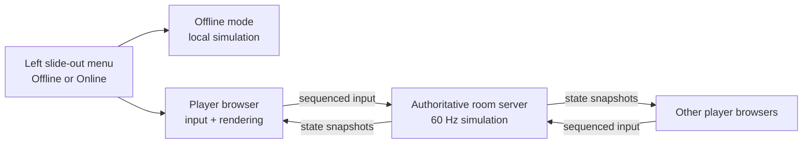

# Online Play Implementation Plan

The best fit is a server-authoritative, room-based online mode: each player sends only controller input, while a Node.js server runs the official simulation and broadcasts match snapshots. This prevents clients from disagreeing about scores, collisions, balls, or match timing while preserving the existing offline mode.

The current implementation keeps match state in browser globals, polls local input, and advances physics directly in the UI loop: [match state](Breadsim6Player.html#L437), [player definitions](Breadsim6Player.html#L446), [input polling](Breadsim6Player.html#L943), and [simulation update](Breadsim6Player.html#L1048). Those responsibilities need to be separated before networking is added.

## How online play will work

1. A three-line hamburger button will sit at the upper-left edge of the simulator. Selecting it will slide a menu out from the left side. The menu will let the player choose **Offline Play** or **Online Play**, show which mode is currently active, and provide the online room controls when Online Play is selected.
2. In **Offline Play**, the simulator will preserve its current behavior: up to six local player slots can be controlled with the existing keyboard and gamepad mappings, and no server connection is required.
3. In **Online Play**, a player either creates a room or enters a short room code.
4. The room creator becomes the host. Each connected device claims one of six seats:
   - P1–P3: Red alliance
   - P4–P6: Blue alliance
5. Players select their name, robot model, and starting position in the shared lobby.
6. The host starts the match. The server validates the lobby and begins the countdown.
7. During play:
   - Each browser reads its keyboard or gamepad.
   - It sends compact input messages—movement, rotation, action, intake toggle, and unstick—to the server.
   - The server runs physics, scoring, match phases, and randomness.
   - The server sends snapshots to every browser.
   - Browsers interpolate remote robots and balls between snapshots. The local robot can use prediction and server reconciliation to make controls feel responsive.
8. If a player disconnects, their input immediately becomes neutral. Their seat is reserved briefly so they can reconnect using a private reconnect token.
9. At match end, the server supplies the authoritative final scores and player breakdown.



## Step-by-step implementation plan

### 1. Establish the online-play rules

Define the initial release narrowly:

- Anonymous invite-code rooms, without accounts.
- Up to six controlling players; optionally allow spectators later.
- One online seat per browser.
- Only the host can start, stop, and reset a match.
- Players can change only their own name, model, and starting position.
- Lobby configuration locks when countdown begins.
- Preserve the existing six-controller offline mode.
- Changing between Offline and Online modes is allowed only while no match or countdown is active.
- Returning to Offline Play cleanly leaves the online room and closes the WebSocket connection.

Write these rules into a short protocol/design document before implementation so UI and server behavior stay aligned.

### 2. Split the single HTML file into modules

Move the inline JavaScript into separate files:

```text
package.json
public/
  index.html
  styles.css
  js/
    app.js
    input.js
    renderer.js
    ui.js
    network.js
shared/
  constants.js
  protocol.js
  simulation.js
  state.js
server/
  index.js
  room-manager.js
  game-room.js
tests/
```

Specific refactoring:

- Move field dimensions, models, phases, and shift tables into `shared/constants.js`.
- Move `Robot`, collision functions, ball updates, scoring, spawning, and reset logic into `shared/simulation.js`.
- Replace direct DOM changes inside simulation code with returned events such as `scoreChanged`, `phaseChanged`, and `matchEnded`.
- Keep canvas drawing in `renderer.js`.
- Keep keyboard/gamepad polling in `input.js`.
- Keep buttons, modals, sounds, the slide-out mode menu, and HUD updates in `ui.js`.

Offline play should call the same simulation API locally. This protects current functionality and gives online and offline play identical rules.

### 3. Make the simulation headless and testable

The server cannot depend on `document`, canvas, audio, `navigator`, or browser timers.

Change the simulation to accept explicit inputs:

```js
stepSimulation(state, inputsByPlayer, deltaSeconds, clock, random)
```

Required changes include:

- Replace `Date.now()` cooldown decisions with simulation time.
- Replace `Math.random()` with an injected seeded random-number generator.
- Give balls and projectiles stable numeric IDs.
- Store every match variable in one serializable `GameState` object.
- Separate configuration state, live match state, and presentation-only state.
- Move match countdown and phase timing to the simulation clock.
- Add `serializeSnapshot()` and `restoreSnapshot()` helpers.
- Make the fixed physics tick independent of browser frame rate.

This also fixes an existing online risk: the current match clock advances by `1/60` whenever `update()` runs, so a throttled browser could run a slower match.

### 4. Define and validate the network protocol

Use native WebSockets with a small Node server. JSON is simplest for the first implementation; binary or delta encoding can be introduced after measuring traffic.

Client-to-server messages:

- `createRoom`
- `joinRoom`
- `claimSeat`
- `updateLobbyPlayer`
- `releaseSeat`
- `startMatch`
- `stopMatch`
- `resetMatch`
- `playerInput`
- `requestFullSnapshot`
- `ping`

Server-to-client messages:

- `roomCreated`
- `roomState`
- `seatAssigned`
- `matchStarted`
- `snapshot`
- `matchEvent`
- `matchEnded`
- `pong`
- `error`

Each input should include a room ID, player seat, monotonically increasing sequence number, and input values. The server must:

- Clamp axes to `-1…1`.
- Convert action values to booleans.
- Reject malformed or oversized messages.
- Ignore stale or out-of-order inputs.
- Verify that the connection owns the specified seat.
- Rate-limit inputs and lobby commands.
- Never accept scores, positions, inventory, or elapsed time from clients.

Add a protocol version to the initial handshake so incompatible clients get a clear refresh/update message.

### 5. Implement rooms and authoritative matches

`room-manager.js` should create unique room codes, find rooms, enforce capacity, and clean up abandoned rooms.

Each `GameRoom` should own:

- Lobby players and seat ownership.
- Host connection.
- Reconnect tokens and disconnect deadlines.
- Current `GameState`.
- Most recent input for each seat.
- Simulation tick and snapshot sequence numbers.
- Match status: lobby, countdown, running, results.
- A seeded random generator.

Run simulation at a fixed 60 Hz using an elapsed-time accumulator. Broadcast snapshots initially at approximately 15–20 Hz.

Because the field contains hundreds of balls, do not permanently send the entire verbose state 20 times per second. Start with:

- Full snapshot on join, reconnect, and periodic recovery.
- Compact incremental snapshots containing changed entities.
- Quantized numeric values where visual precision permits.
- Immediate reliable events for scores, phases, starts, stops, and results.

Measure the real payload size before considering a binary protocol.

### 6. Create the left-side mode menu

Add a three-line hamburger button in the upper-left corner of the simulator. Pressing it should slide a panel out from the left, and pressing it again, selecting a mode, pressing Escape, or clicking the backdrop should close it.

The menu should include:

- A clear **Play Mode** heading.
- **Offline Play** and **Online Play** choices.
- A visible active-mode indicator.
- A short explanation of each mode.
- Create Room and Join Room controls that appear only in Online Play.
- Connection and room status when online.
- A Leave Room action while connected.

Implementation details:

- Use an actual `<button>` with an accessible label such as `Open play mode menu`, not a clickable decorative icon.
- Give the panel suitable dialog/navigation semantics and keep keyboard focus inside it while open.
- Return focus to the hamburger button when it closes.
- Animate with `transform: translateX(...)` so the canvas does not need to be resized or reflowed.
- Honor `prefers-reduced-motion` by removing the slide animation.
- Place the panel above the canvas and controls with a defined `z-index`.
- Make it usable on narrow screens without covering an inaccessible close control.
- Persist the last selected mode locally, but default safely to Offline Play if the online server cannot be reached.
- Do not discard or reset an active match merely because the menu was opened.
- If the user requests a mode change during a countdown or match, explain that the match must be stopped first instead of switching silently.

### 7. Build the online lobby UI

When Online Play is selected, show an online lobby containing:

- Create Room and Join Room controls.
- Shareable room code and copy button.
- Six seat cards showing alliance, connection status, player name, model, and starting position.
- Claim/leave-seat actions.
- Host badge and start button.
- Ready/connection indicators.
- Clear full-room, duplicate-seat, invalid-code, and version-mismatch errors.

Existing player-side controls should become read-only for settings the current connection does not own. During a match, lobby configuration controls should be locked.

### 8. Connect local input to the server

Refactor `getInputs()` so it returns a normalized input frame independent of any player object. In online mode:

- Poll input at the normal render rate.
- Send when values change and at a small heartbeat interval.
- Attach an incrementing sequence number.
- Send a neutral input immediately on blur, controller loss, or visibility change.
- Treat the unstick command and Blitz intake toggle as edge-triggered actions so retransmission cannot activate them twice.
- Keep keyboard and gamepad mapping local to the player’s browser.

The server should time out stale input to neutral after a short interval, preventing a disconnected robot from continuing to drive.

### 9. Render synchronized state smoothly

Maintain a buffer of recent server snapshots:

- Render remote robots and balls slightly behind server time and interpolate between snapshots.
- Extrapolate only for a short bounded period if a snapshot arrives late.
- Snap or smoothly correct entities when the error becomes too large.
- Show connection quality and a reconnect overlay when updates stop.

For the controlled robot, add client-side prediction:

1. Apply local input immediately to a predicted robot.
2. Retain unacknowledged input frames.
3. When a server snapshot acknowledges an input sequence, reset to the authoritative robot state.
4. Reapply the remaining inputs.
5. Smooth small visual corrections; snap impossible or very large corrections.

Only the controlled robot needs prediction initially. Scores, balls, projectiles, and other robots should always follow server state.

### 10. Handle reconnects and room lifecycle

When joining, issue a random private reconnect token stored in session storage.

On disconnect:

- Neutralize the player’s input immediately.
- Mark the seat disconnected.
- Reserve it for approximately 30 seconds.
- Restore the seat and send a full snapshot if the token reconnects.
- Release the seat after the grace period.

Also define:

- Host transfer if the host leaves.
- Room deletion after all clients leave.
- Cleanup after inactive lobbies.
- Behavior when the server restarts—initially, rooms can be ephemeral, but the UI should say the match was lost rather than silently desynchronizing.

### 11. Harden and deploy

Serve the client and WebSocket endpoint from the same Node application to simplify deployment.

Production requirements:

- HTTPS/WSS.
- Origin checking.
- Message size limits and schema validation.
- Per-IP and per-connection rate limits.
- Maximum room count and maximum spectators.
- Structured logs for joins, disconnects, match starts, and server exceptions.
- Health endpoint and graceful shutdown.
- No client-supplied HTML in names; continue using `innerText`.

## Testing plan

### Automated simulation tests

Use a seeded RNG and fixed tick clock to test:

- Robot acceleration, rotation, damping, and field boundaries.
- Robot/robot, robot/ball, ball/ball, and obstacle collisions.
- Intake capacity and projectile consumption.
- Each robot model’s firing behavior.
- Hub activity and scoring attribution.
- Auto winner and shift sequence.
- Match transitions at 20, 23, and 163 seconds.
- Start positions for grouped robots.
- One-use unstick behavior and freeze duration.
- Reset producing the same initial state for a known seed.
- Running the same seed and inputs twice producing identical state.

### Menu and mode-selection tests

Test the new slide-out menu with mouse, keyboard, and touch-sized viewports:

- The three-line button opens and closes the menu.
- Escape and backdrop clicks close it.
- Focus enters the menu and returns to the trigger when closed.
- Offline and Online choices update the active-mode indicator.
- Online-only room controls are hidden in Offline Play.
- The last chosen mode is restored after a reload.
- An unavailable server produces a useful error and allows Offline Play to continue.
- Opening and closing the menu does not reset match state.
- Mode switching is blocked during countdowns and active matches.
- Leaving Online Play closes the connection and releases the claimed seat.
- Reduced-motion preferences disable the slide animation.
- The menu and close control remain usable on narrow screens.

### Protocol and server tests

Create simulated WebSocket clients and verify:

- Room creation and joining.
- Six unique seat assignments.
- Full-room and invalid-code rejection.
- Only seat owners can update settings or send input.
- Only the host can control the match.
- Lobby settings lock during countdown.
- Stale input sequences are ignored.
- Invalid axes and malformed payloads are rejected safely.
- Disconnects neutralize input.
- Reconnect tokens restore the correct seat.
- All clients receive the same score and final result.

### Browser end-to-end tests

Use Playwright with multiple browser contexts:

1. Open the hamburger menu and select Online Play.
2. Create a room in one browser.
3. Join from five more contexts.
4. Claim all six seats.
5. Change names, models, and starts.
6. Start the match.
7. Drive and fire from multiple clients.
8. Confirm synchronized HUD, robots, and scores.
9. Disconnect and reconnect one browser.
10. Finish and verify identical results everywhere.
11. Return to the menu, leave the room, select Offline Play, and verify a local match still works.

Keyboard input can be automated. Physical gamepads should also receive a manual compatibility pass because browser gamepad emulation does not cover every controller mapping.

### Network-quality tests

Run matches under simulated conditions:

- 50, 100, and 200 ms latency.
- Jitter of approximately 20–50 ms.
- Temporary connection loss.
- A small percentage of delayed or dropped snapshot messages.
- Browser tab backgrounding and return.

Verify that the server remains authoritative, local prediction is corrected, match time does not drift, actions do not duplicate, and final scores remain identical.

### Load and regression tests

- Run multiple six-player rooms simultaneously and measure CPU, memory, snapshot size, and outbound bandwidth.
- Soak-test matches repeatedly for entity leaks and room-cleanup failures.
- Re-run the existing offline six-player flow after every networking change.
- Test keyboard-only, mixed controller/keyboard, disabled seats, cancel-start, stop-match, reset, and replay.

## Definition of done

Online play is ready when six separate browsers can use the left-side menu to select Online Play, join one room, control distinct robots through a full match, reconnect without losing their seat, and always display the server’s identical final score. The same menu must allow the user to return to Offline Play, offline six-player play must remain functional, and ordinary latency should produce smooth remote movement without allowing any client to directly alter match state.
